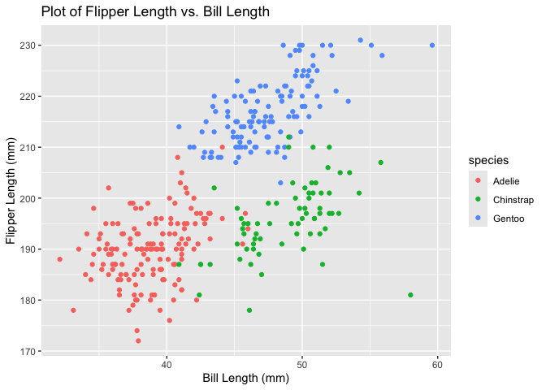

P8105 - Homework 1
================
Joe LaRocca
September 19, 2024

## Problem 1

##### Upload the Palmer Penguins Data

``` r
data("penguins", package = "palmerpenguins")
```

The data include the species of penguin, the island the penguin comes
from, the penguins’ bill length, bill depth, and flipper length (all
measured in mm), their body mass (measured in g), their sex (male or
female) and the year in which the data point was taken (from 2007 to
2009, inclusive).

The dataset has 344 rows, meaning that there are 344 penguins in the
dataset. It has 8 columns, so there are a total of 8 variables being
measured.

The mean flipper length is about 200.92 mm, not including penguins for
which the flipper length value is missing.

##### Create the scatterplot for Flipper Length (y) vs. Bill Length (x)

``` r
flipper_bill_plot = ggplot(data = penguins, 
       aes(x = bill_length_mm, 
           y = flipper_length_mm,
           col = species)) + 
  geom_point() + 
  labs(title = "Plot of Flipper Length vs. Bill Length",
       x = "Bill Length (mm)",
       y = "Flipper Length (mm)")

flipper_bill_plot
```

    ## Warning: Removed 2 rows containing missing values or values outside the scale range
    ## (`geom_point()`).

<!-- -->

``` r
ggsave(filename = "flipper_bill_plot.png",
  plot = flipper_bill_plot)
```

    ## Saving 7 x 5 in image

    ## Warning: Removed 2 rows containing missing values or values outside the scale range
    ## (`geom_point()`).

## Problem 2

``` r
problem_2_df = tibble(
  random_normal = rnorm(10, mean = 0, sd = 1),
  logical = random_normal > 0,
  character = c("a", "b", "c", "d", "e", "f", "g", "h", "i", "j"),
  factor = factor(
    c("High", "Medium", "Low", "Low", "Medium", 
      "Medium", "High", "Low", "High", "Low"))
)

problem_2_df
```

    ## # A tibble: 10 × 4
    ##    random_normal logical character factor
    ##            <dbl> <lgl>   <chr>     <fct> 
    ##  1        -1.97  FALSE   a         High  
    ##  2         0.104 TRUE    b         Medium
    ##  3         0.805 TRUE    c         Low   
    ##  4         0.721 TRUE    d         Low   
    ##  5        -0.154 FALSE   e         Medium
    ##  6        -1.60  FALSE   f         Medium
    ##  7        -0.643 FALSE   g         High  
    ##  8         0.259 TRUE    h         Low   
    ##  9        -1.98  FALSE   i         High  
    ## 10         0.138 TRUE    j         Low

##### Take the mean of the standard Normal and Logical column

``` r
problem_2_df %>% 
  pull(random_normal) %>% 
  mean()
```

    ## [1] -0.4323793

``` r
problem_2_df %>% 
  pull(logical) %>% 
  mean()
```

    ## [1] 0.5

The means of the `random_normal` and `logical` columns are -0.4323793
and 0.5 respectively. The `character` and `factor` columns have no
defined mean; when I try to take their mean, I get an error message
saying that the argument is not numeric or logical.

##### Try converting variables using as.numeric()

``` r
problem_2_df %>% 
  mutate(logical = as.numeric(logical)) %>% 
  mutate(character = as.numeric(character)) %>% 
  mutate(factor = as.numeric(factor))
```

Applying `as.numeric()` to the `logical` variable converts all “TRUE”
values to “1” and all “FALSE” values to 0. Applying `as.numeric()` to
the `character` variable converts all of the characters into `NA`.
Applying `as.numeric()` to the `factor` variable converts the variable
into numbers corresponding to the alphabetical order of the factor
variable. In my case, all “HIGH” values were converted to “1”, all “LOW”
values were converted to “2”, and all “MEDIUM” values were converted to
“3”.
